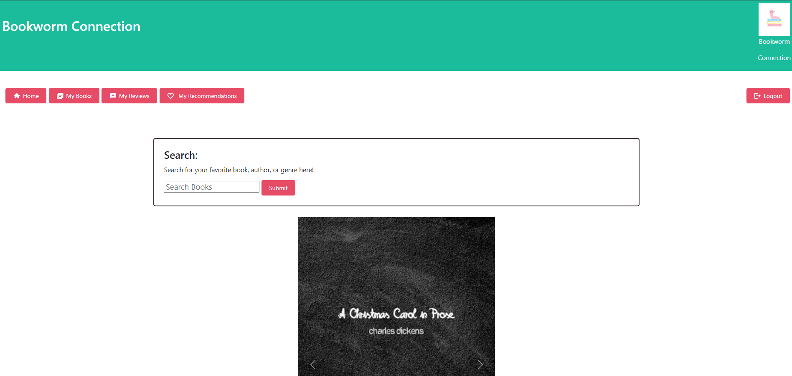
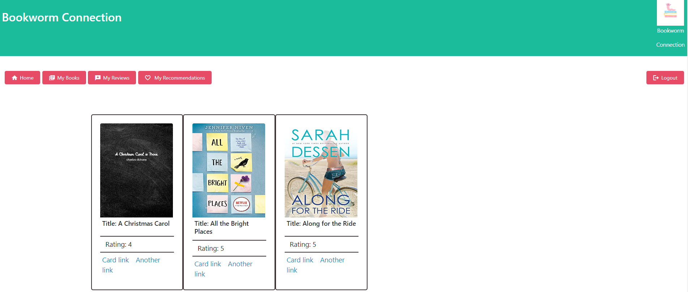
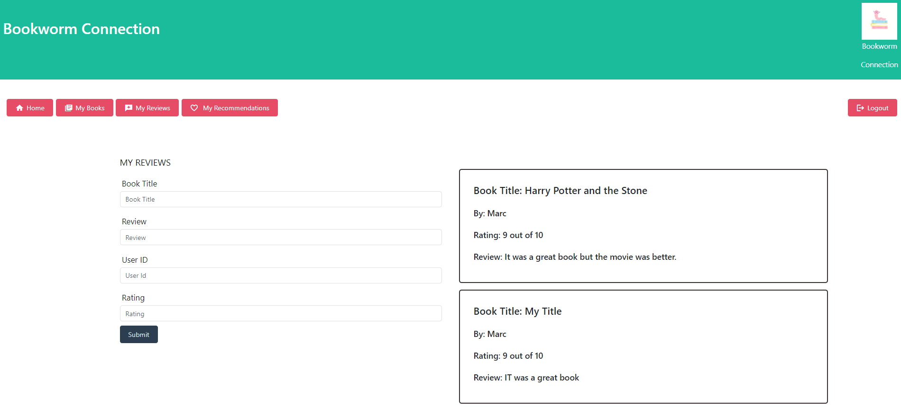

# Book Connection

## Table Of Contents

- [Description](#project-description)
- [Installation](#installation)
- [Usage](#usage)
- [Contributing](#contributing)
- [Testing](#testing)
- [Questions](#questions)

## Project Description

      Book Connection allows users to seach and add book into their acccount. They can also add their own reviews of the lates books that they have read. The reviews allow other users to see the highest rated books. Lastly, Book Connection allows you to recommend books to other users.

### Licensing

Mit

### Gif/Screenshot

### Deployed Website

[Deployed Link](https://aqueous-wildwood-40784-bbb428a30b2f.herokuapp.com/)

[Git Repo Link](https://github.com/Kayla-Sullens/Project-2)

## Installation

      To install this project open the "Deployed Link or Github repository" link. Clone the repository using the git clone on the command-line To open

## Usage

      First, click the heroku link to take you to the login page. In the signup section, create an account. After your account is created, you are redirected to the profile page. Here is all the links you will need to navigate through the page. Here you will be able to seach books, save books to your account, add reviews to book, and make recommendations.

## Contributing

      To contribute to this project, clone and fork the repo, once the edits have been created on the new branch, submit a pull request. Once approved, the changes will be merged to the main branch.

## Testing

      The project can be tested using the users own data.

## Questions

      Reach out to the owner of the repo, https://github.com/Kayla-Sullens/Project-2
